# Exercise: Create a new API that syncs with Salesforce, using App Connect

A common requirement, when developing enterprise applications, is the need to access existing data sources in other external servies - for example exchanging data with a SaaS application. A good design practice is to enable this by creating a bespoke API that provides just the specific access you need. In this lab you will create an API to push client data to Salesforce, using App Connect. This will occur whenever a user interacts with the API.

For this exercise, we want to create an API that can be called with details of a new contact (i.e. First Name, Last name and Email), which will result in a new **Contact** record being created in Salesforce. The API should return a ClientID for the new contact, and a code of 200 if successful.

## Steps

1. [Sign up for Salesforce Developer Edition](#1-sign-up-for-salesforce-developer-edition)
1. [Create a Salesforce Connected App](#2-create-a-salesforce-connected-app)
1. [Setup connectivity to Salesforce in App Connect Designer](#3-setup-connectivity-to-salesforce-in-app-connect-designer)
1. [Create the flow in App Connect Designer](#4-create-the-flow-in-app-connect-designer)
1. [Save your Salesforce credentials as a Kubernetes secret](#5-save-your-salesforce-credentials-as-a-kubernetes-secret)
1. [Create an Integration Server instance and deploy your flow](#6-create-an-integration-server-instance-and-deploy-your-flow)
1. [Test your App Connect Flow](#7-test-your-app-connect-flow)
1. [Summary](#summary)

### 1. Sign up for Salesforce Developer Edition

In your browser go to the following URL to sign up for Salesforce Developer Edition - a full featured version of the Salesforce Lightning Platform. **Note:** If you already have access to the Salesforce Developer Edition or a paid version of Salesforce, skip to **Step 2**.

[Salesforce Developer Edition signup](https://developer.salesforce.com/signup)

Enter the required information and follow the prompts to complete the signup process.

### 2. Create a Salesforce Connected App

In this section you'll create a *Connected App* in Salesforce so that the App Connect flow that you create later will be able to access your Salesforce data.

Login to [Salesforce](https://www.salesforce.com)

Click on your avatar (top right) and select **Switch to Salesforce Classic** from the context menu.

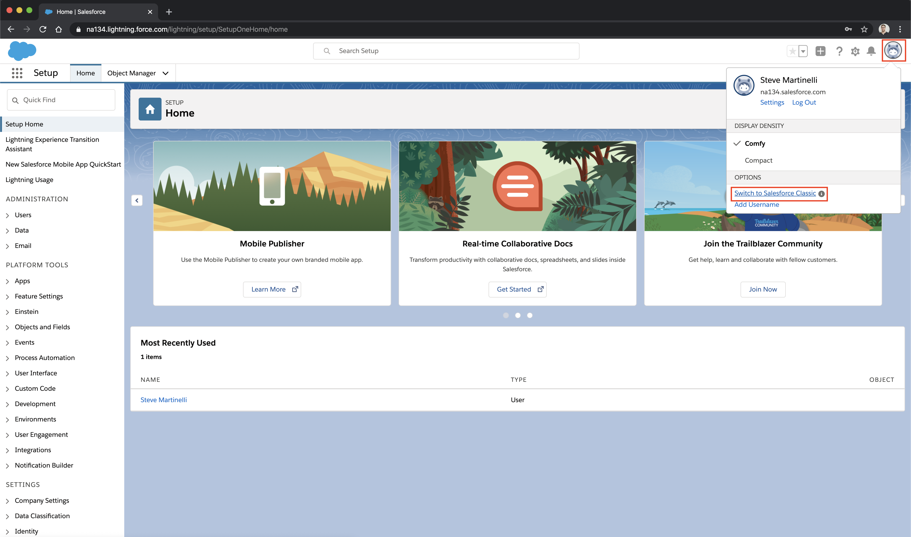

Click on **Setup**.


In the left navigation area, scroll down to the **Build** section, expand **Create** and click on **Apps**

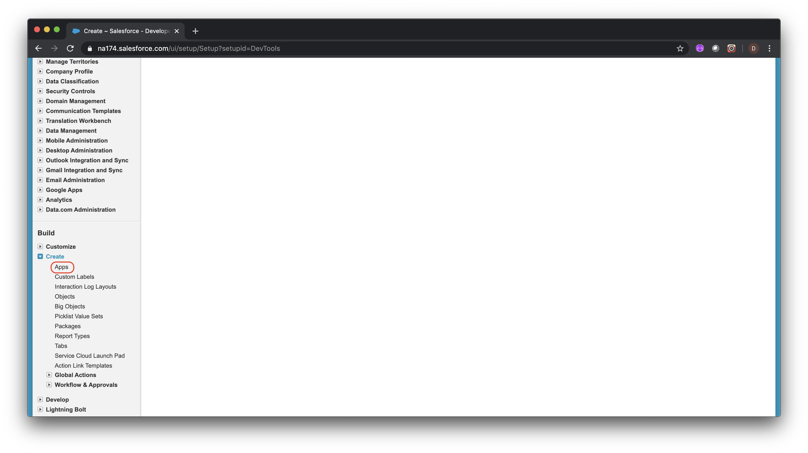

In the main panel, scroll down to the **Connected Apps** section and click on **New**

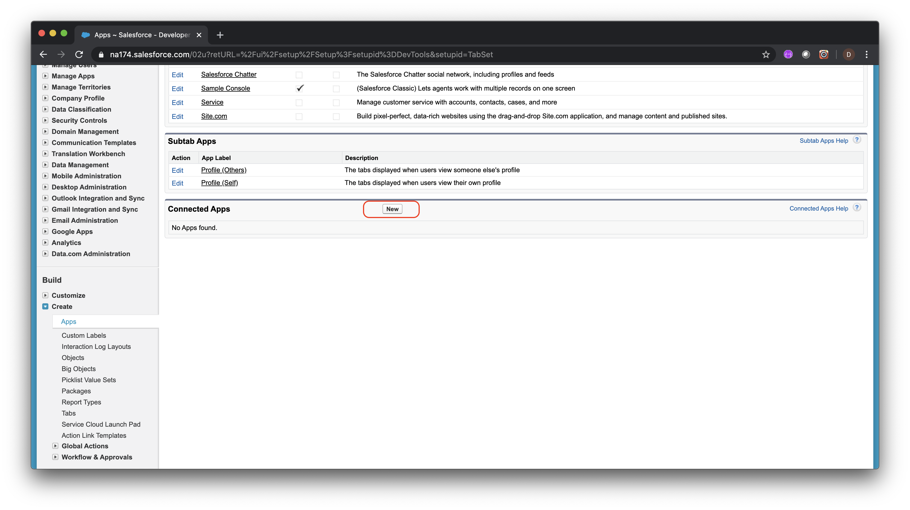

Fill in the required values for a new Connected App

* Set the **Connected App Name** property to `IBM App Connect`
* Set the **API Name** to `IBM_App_Connect`
* Enter your email address as the **Contact Email**


In order for the external service that you are going to build to talk to Salesforce securely, it will need to be able to authenticate. For this exercise you will enable this via Oauth, so to confirm this:

* Select the **Enable OAuth Setting** check box.
* Set the **Callback URL** to `https://www.ibm.com`
* Under **Selected OAuth Scopes** select **Access and manage your data (api)** and click the arrow under the **Add** label


Scroll down to the bottom of the web page and click **Save**

You will typically be told that you will need to wait 2-10 mins for your changes to take effect. However, you can still click **Continue** to see the details of your new Salesforce application and continue with the steps below, while this process is going on.

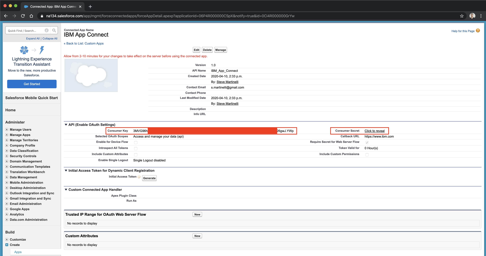

Now that Salesforce has generated the OAuth credentials, you need to copy these so you can later insert them into your own service that will call Salesforce. These credentials come in two flavors - first the credentials for this specific Salesforce connected App, and second the credentials to log into Salesforce itself.

For the credentials for this specific Salesforce connected App, copy the **Consumer Key** and **Consumer Secret** to a scratchpad or text file.

For the credentials to log into Salesforce itself, you need to save off your Salesforce username (which would have been confirmed in the Salesforce welcome email), and your login seecurity token. This token may have been sent to you in a seperate email (with the subject **Your new Salesforce security token**), otherwise you can ask Salesforce to reset the token and send you a new email, by going to the account **Settings** and click on **Reset My Security Token**.


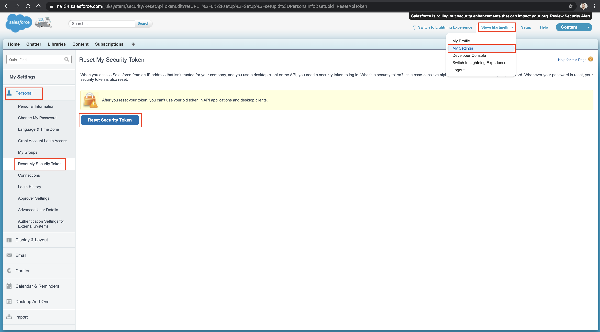

Copy both the username and the security token to the same scratchpad or text file in which you stored the consumer key and secret - so that you have all the credentials you need for the next step.

### 3. Setup connectivity to Salesforce in App Connect Designer

App Connect Designer is a component of Cloud Pak for Integration that provides an authoring environment in which you can create, test, and share flows for an API. You can share your flows by using the export and import functions, or by adding them to an Asset Repository for reuse.

In a new browser tab in the desktop VM, open the **Cloud Pak for Integration** tab and under **View Instances** click on the link for **App Connect Designer**.


**App Connect Designer** will prompt you to login (the user name and password should already be include). Once logged in, click the **Settings** icon and then select **Catalog**.

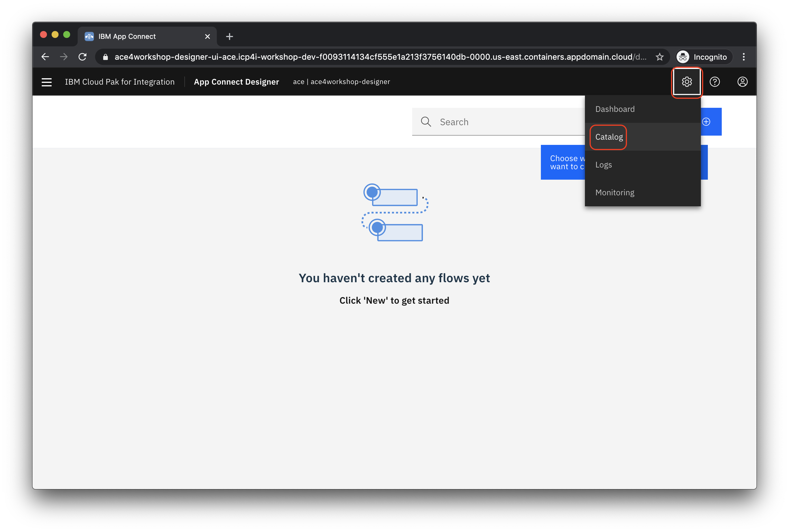

Scroll down to find the **Salesforce** entry and expand it. If there are existing connections shown in a drop down list select **Add a new account ...** from that list.


> **NOTE** If there are no existing connection shown click on **Connect**

Enter the following values referring to the text file from the previous section where you saved your Salesforce credentials.

* For the **Login URL** enter `https://login.salesforce.com`.
* For the **Username** enter the email you use to login to Salesforce.
* For the **Password** enter the password you use to login to Salesforce. Then append the value of the **Security Token** (that you saved in the previous section) to the password. For example if your password is `foo` and your security token is `bar` you would enter `foobar` into the password field.
* For the **Client Id** copy and paste the value of the **Consumer Key** (that you saved in the previous section).
* For the **Client Secret** copy and paste the value of the **Consumer Secret** (that you saved in the previous section).


Click on **Connect**. If successful, the connection will be given a default name of the form *Account n*.

> **NOTE**: If you receieve an error that the connection to Salesforce failed, then it is recommneded to re-check the credentials and try again. You can re-enter the credentials for this account by clicking on the three dots next to the account name (typically this is **Account 1**), and clicking **Update Account** from the subsequent menu. The previous details are cleared, so you will need to enter them all again.

### 4. Create the flow in App Connect Designer

In App Connect, you can create a flow for what happens when someone calls your API and you need to manipulate this data in order to map it to a call to the external service, in this case Salesforce. At a minimum, you typically need to provide the mapping of data fields between that your API is exposing and what the eternal service is expecting.

To create a flow in App Connect Designer, click the **Settings** icon and then select **Dashboard**:

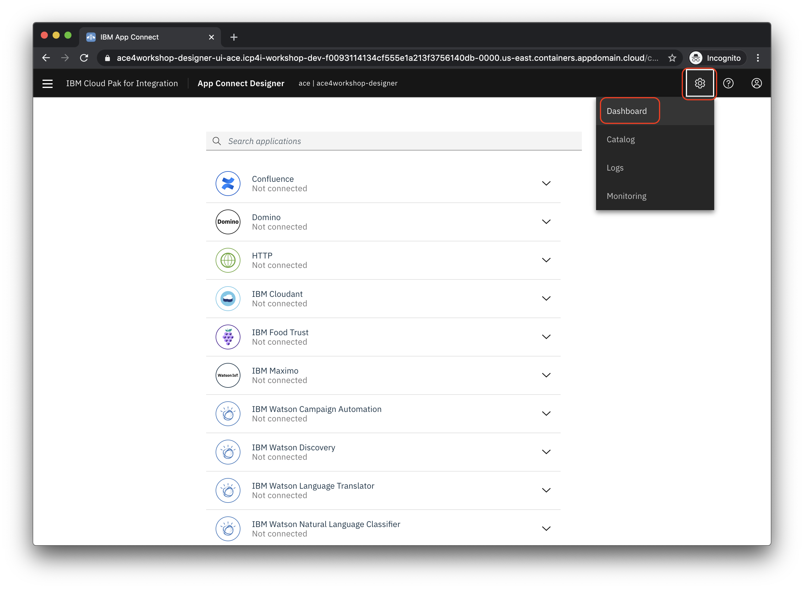

Click **New** and select **Flows for an API**


* Name the flow `user001sf` or some other unique name.
* Name the model `Client`.

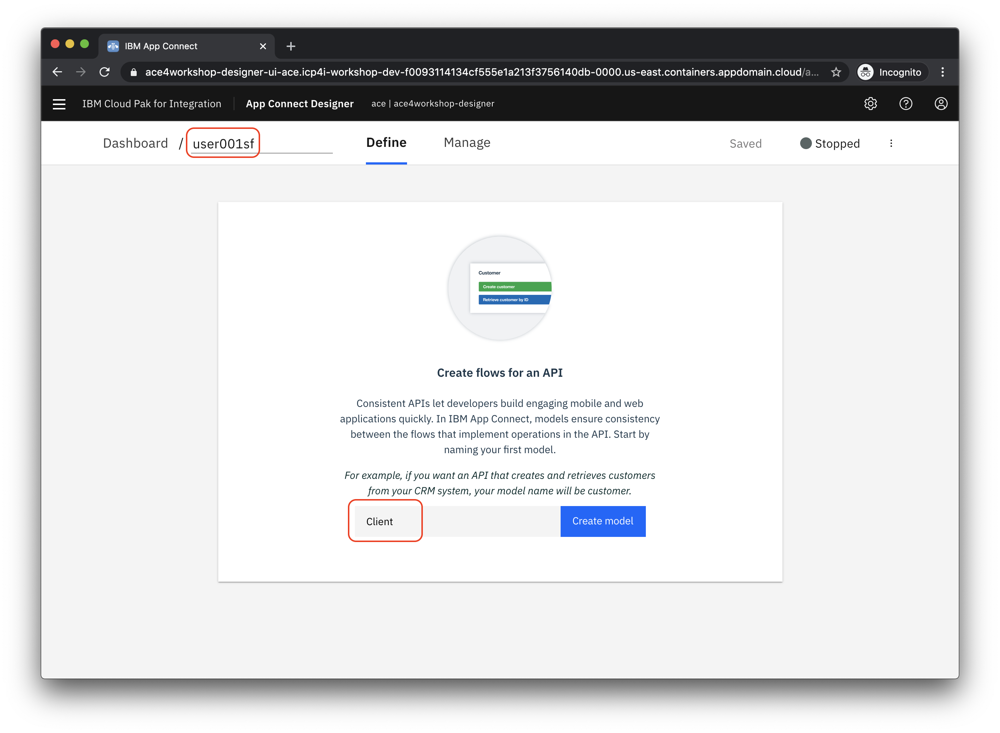

In App Connect, the concept of a *model* is used, amoung other things, to define the mapping of fields and parameters. Click **Create Model**.

First you will add the properties of the data that you will handle in the flow to your model.

> **NOTE**: To make the mapping to Salesfroce easier, name the properties **exactly** as instructed (including matching case) so that your flow will work with the Salesforce app.

* Enter `ClientId` as the first property and then click **Add property +**
* Enter `FirstName` as the next property and then click **Add property +**
* Enter `LastName` as the next property and then click **Add property +**
* Enter `Email` as the next property

When you're done the screen should look like the following:


Now you need to tell App Connect what to do with these parameters (which in this case is to create a contact in Salesforce). To do this you create an *operation*, by clicking **Operations** and then select **Create Client**:


Click **Implement flow**. Click on the **+** icon.

* Scroll down to Salesforce
* Select your account from the dropdown
* Expand **Contacts**
* Click **Create Contact**


Next you'll map the properties from your model to the Salesforce Contact properties. For our API, an *Account Id* will be returned by Salesforce for our new contact, and we want to map it to a field called *Client Id* to return via our API to the caller. To ceate this mapping, click in the text box for the **Account Id** property and then click on the icon just to the right of the field. Select the **ClientId** property of your model:


The remaining properties have the same names as their Salesforce equivalents so click on **Auto match fields** to complete the mapping.

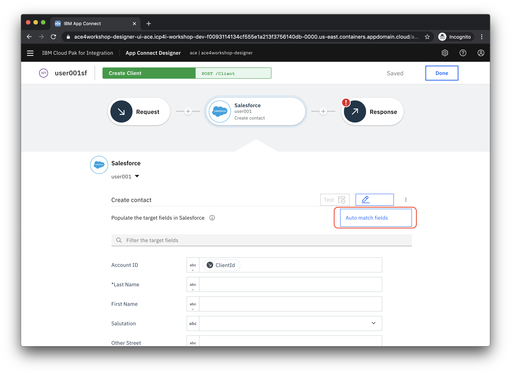

Click on **Response** to configure what will be returned by the flow. Click in the text box for the **Client Id** property and then click on the icon just to the right of the field. Select the **Contact Id** property of the **Salesforce/Create** contact menu.

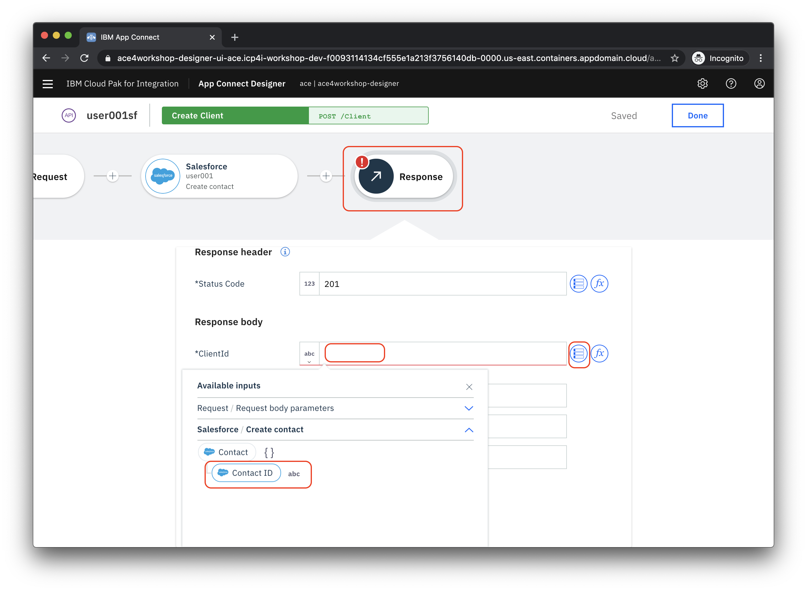

Next you'll test the flow to make sure it works. Click on the middle part of the flow and then click on the edit icon.

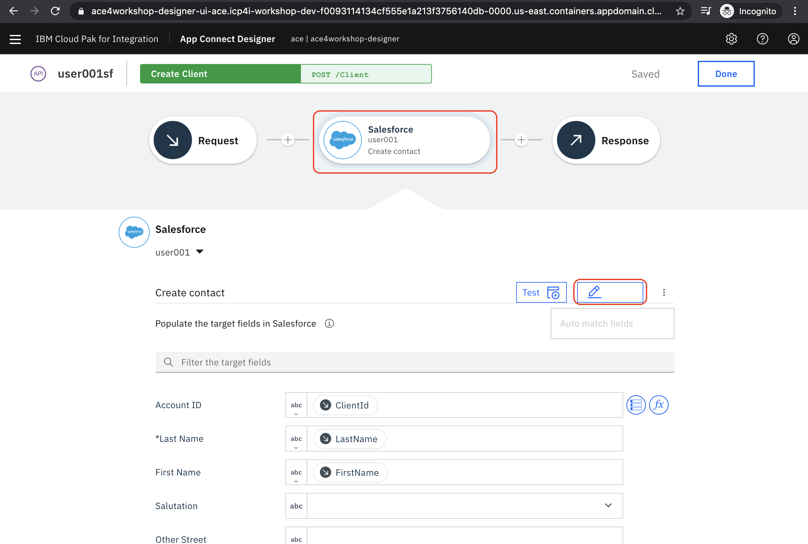

Click on **Request body parameters** and then the **Object** below it. Edit the input parameters that will be used in the test.

* Set the **Client Id** to blank. This value will be generated by Salesforce and returned.
* Enter a **FirstName** value.
* Enter a **LastName** value.
* Enter an **Email** in a valid email format


Click the test icon. Verify that the operation returns a 200 HTTP status code.


Click **View details** to see the raw data returned from the call to Salesforce (note this is not the same as the data returned by the flow which you defined in the **Response** stage of the flow). The **Account ID** will show as an empty string. Click **Done**.

Now that we have a flow built, you need to have this deployed and running so that the API is available to be called externally. If you had built the equivilent of this flow in regular code, then you might be looking to package and deploy this in a container or VM. However, App Connect provides an *Integration Server* that will run the flow directly for you, removing this step. To do this, you'll export the flow so it can deployed in an Integration Server instance. Click the **Settings** icon and then select **Dashboard**. Click the 3 vertical dots on the tile for your new flow and select **Export ...** from the context menu.


Select **Export for integration server (BAR)** and click **Export**

Save the file to a folder of your choosing.

### 5. Save your Salesforce credentials as a Kubernetes secret

When you flow is running in an Integration Server, it will need access to the same authentication credentials we used when we tested the flow in the App Connect Designer. Since we are running on Kubernetes, the standard way you do this is to create a Kubernetes secret containing this information in the OpenShift cluster running Cloud Pak for Integration. You will do this using the OpenShift CLI.

In order to use the OpenShift CLI against you cluster, you first need to get an authentication token for it. To do this, navigate to the OpenShift console in a new tab in the browser running in the desktop VM. Click the profile on the top right and choose the **Copy Login Command** option.


You'll be forced to choose a login method, choose **htpasswd** and use the pre-filled credentials.

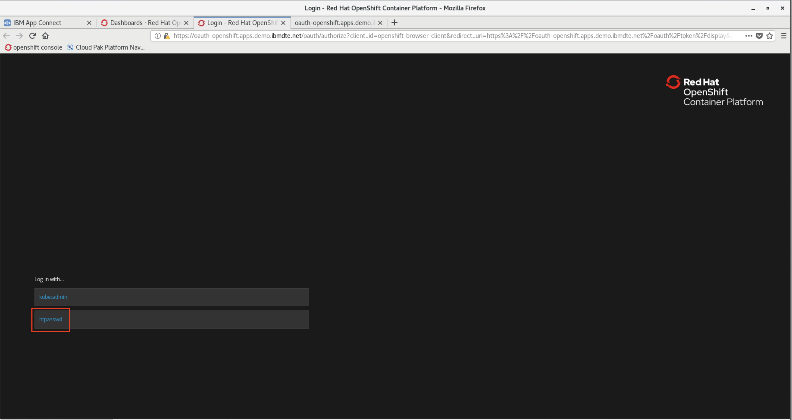

Click the **Display Token** option and copy the `oc login` command.


In the Linux desktop on the desktop VM, open a new *Terminal* window (you can find this in the **Applications** menu on the top left of the screen to do this). Paste in the `oc login` command and run it:

```bash
$ oc login --token=KoSCnw....SmQz0 --server=https://api.demo.ibmdte.net:6443
Logged into "https://api.demo.ibmdte.net:6443" as "ibmadmin" using the token provided.

You have access to 67 projects, the list has been suppressed. You can list all projects with 'oc projects'
```

You are now logged into your cluster. Each of the components of Cloud Pak for Integration run in their own project namespace. The App Connect project namespace is called `ace`, so you need to switch to that project:

```bash
$ oc project ace
Now using project "ace" on server "https://api.demo.ibmdte.net:6443".
```

To create a secret, copy and paste the following text into a file (use: `nano sfcred.yaml` for instance), substituting your own values in place of the generic values.

> **Note** that the **name** attribute must match the account name of the SalesForce connection in App Designer - by default it should be **Account 1** unless changed explicitly.

```yaml
---
accounts:
  salesforce:
    - credentials:
        authType: "oauth2Password"
        username: "<your_sf_email_login>"
        password: "<password_and_security_token>"
        clientIdentity: "<consumer_key>"
        clientSecret: "<consumer_secret>"
      endpoint:
        loginUrl: "https://login.salesforce.com"
      name: "Account 1"
```

Once updated with your correct values, run the following command to create the secret. The command below will name the secret `sfcred`, you'll need this name later so choose one that you will remember.

```bash
oc create secret generic sfcred --from-file=credentials=sfcred.yaml
```

### 6. Create an Integration Server instance and deploy your flow

In this step you'll create an Integration Server instance and deploy your flow to it.

In a new browser tab open the **Cloud Pak for Integration** tab and under **View Instances** click on the link for **App Connect Dashboard**.


> **NOTE**: You may get a security warning when you launch this - if you do it is OK to accept this and agree to make this warning an exception.

Once loaded, click on **Create server**


Click **Add a BAR file** and select the file you exported at the end of the previous section.


Click **Continue**. Skip the next prompt asking to download a configuration package, by clicking **Next**.

Select **Designer** as the type of Integration that you want to run and click **Next**


Change the setting for **Show everything** to **ON**.

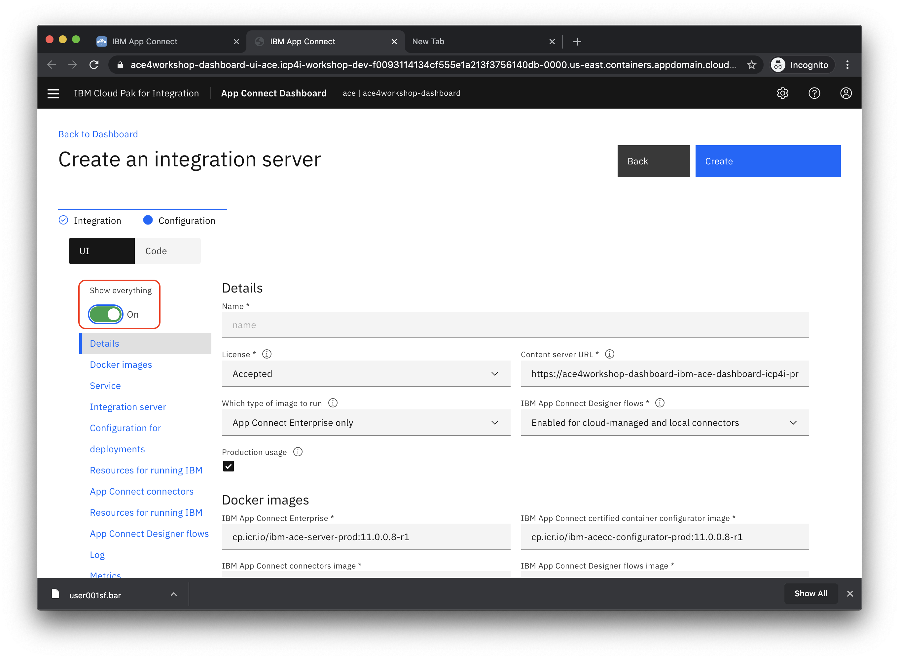

Enter the following settings:

* In the **Details** section for the **Name** enter the name of the *Flow* from step 3, we used `user001sf`.
* In the **Details** section for **IBM App Connect Designer flows** select **Enabled for local connectors only**
* In the **Integration Server** section for **Name of the secret that contains the server configuration** enter `sfcred`.
* In the **Configuration for deployments** section change the **Replica count** to 1

The top half of the dialog should look like the following:

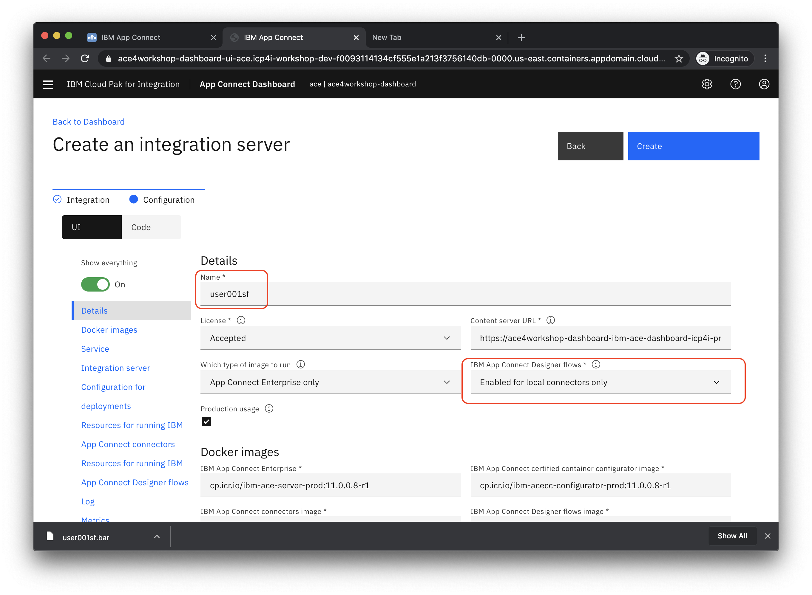

The bottom half of the dialog should look like the following:


> **NOTE**: The name of the integation server will be `user001sf`, rather than that shown in the above picture.

Click **Create**. The status of the server will be eventually shown. Wait until the server status shows as **Started**. Note you may have to refresh the page to see the status change.


### 7. Test your App Connect Flow

To test the API by, say, using `curl`, we first need to know the URL to call. To obtain this, in the App Connect Dashboard, click on the tile for your new server

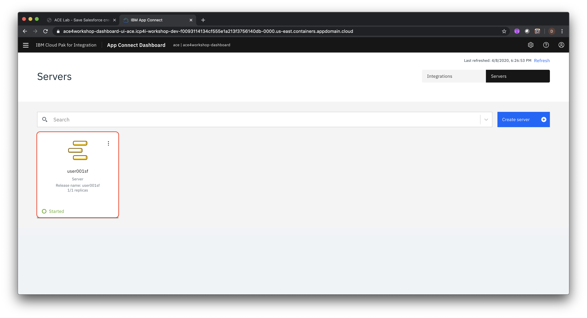

Click on the API tile to see the details of the flow's API

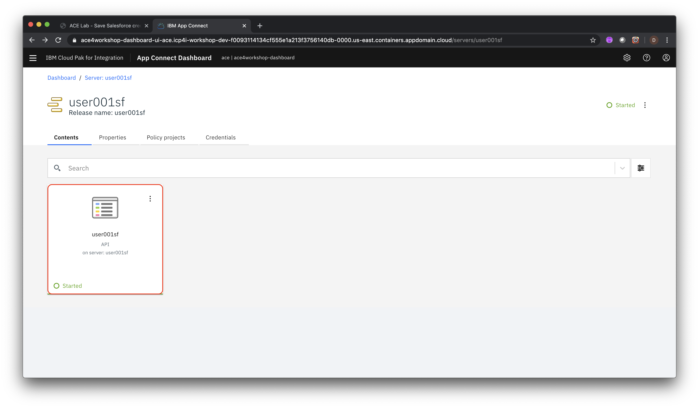

You should see the details of your flow's API


Copy the **REST API Base URL** to the clipboard

You can now execute an API call to this URL to post the details of a new contact (which should result in this being inserted into Salesforce). In a Terminal you should run the following `curl` command (with your own URL subsituted):

```bash
curl -X POST -H "Content-Type: application/json" -d '{"FirstName":"Steve", "LastName":"Martinelli", "Email":"stevemar@ca.ibm.com"}' <your URL here>
```

You should see output like the example below. Verify that the ID of the new Salesforce contact is returned.

```bash
$ curl -X POST -H "Content-Type: application/json" -d '{"FirstName":"Steve", "LastName":"Martinelli", "Email":"stevemar@ca.ibm.com"}' http://user001sf2-http-ace.apps.demo.ibmdte.net:80/user001sf/Client

{"ClientId":"0034R00003L1YPuQAN"}
```

Note how the API returns the `ClientID` as you described in your flow.

In a new browser tab login to Salesforce. Click on the **+** icon and then on **Contacts**

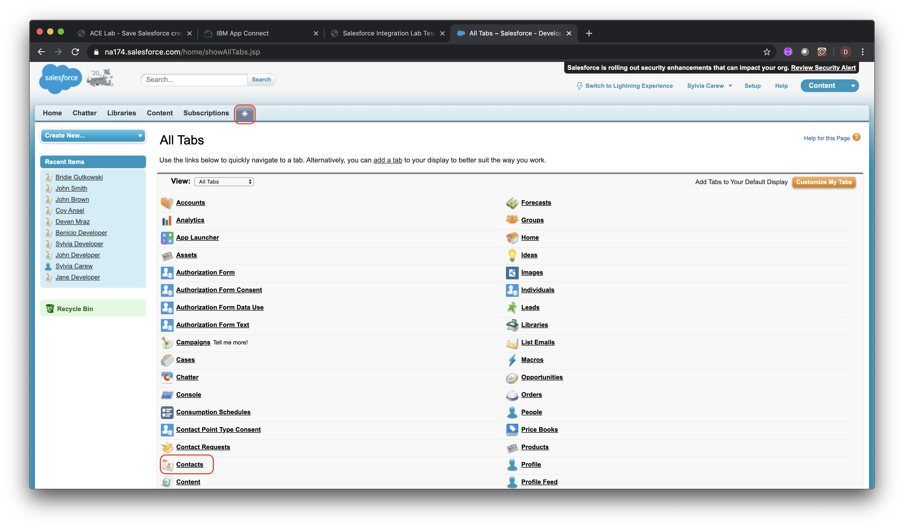

Verify that the new contact you created via your test is there


## Summary

**Congratulations**! You successfully completed the following key tasks in this lab:

* Connected to Salesforce
* Created an App Connect designer flow to push client data to Salesforce contacts.
* Deployed the flow as an Integration Server in App Connect Dashboard
* Tested the flow with new data.
