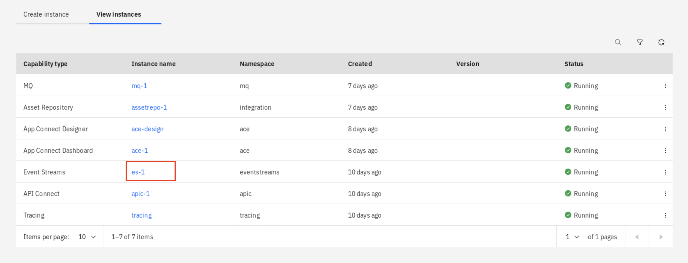
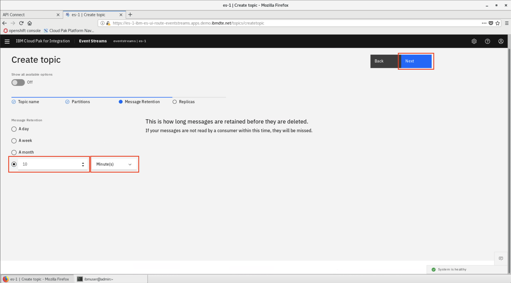
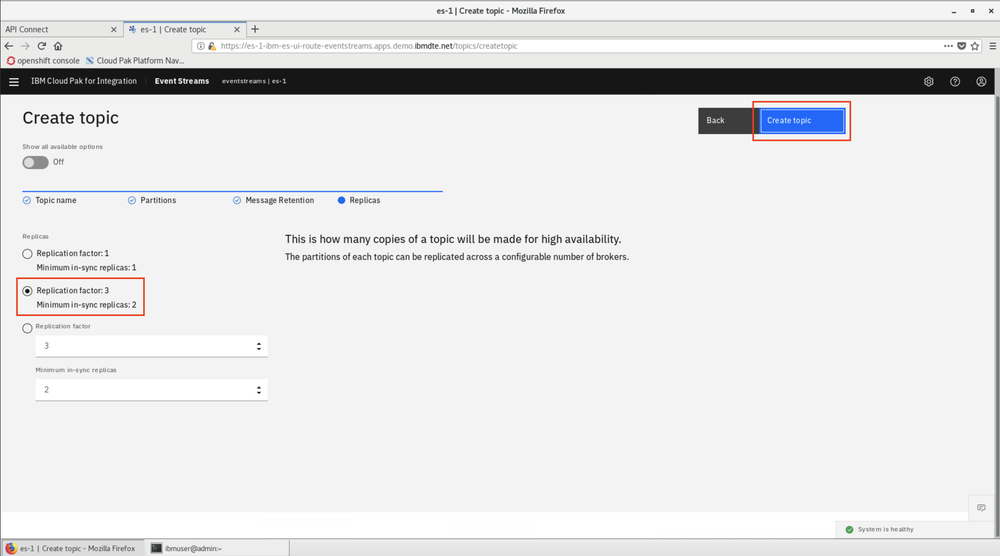
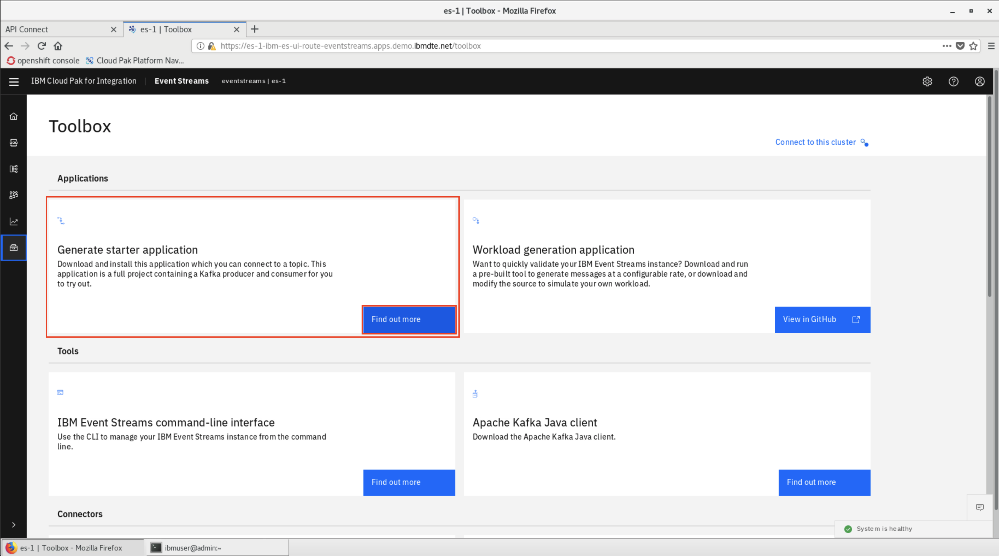
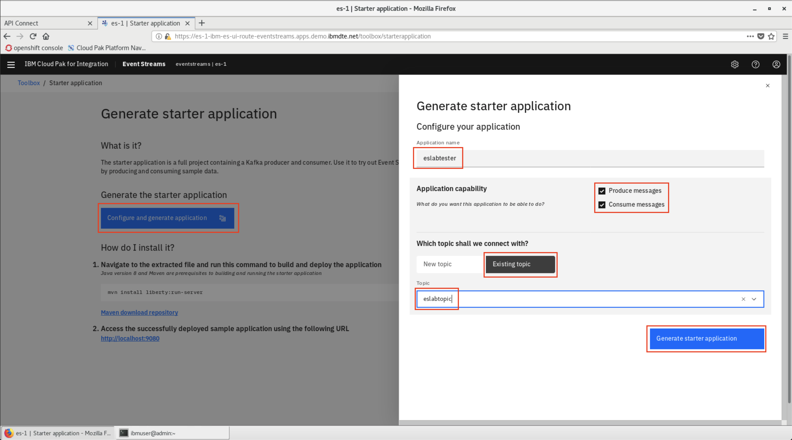
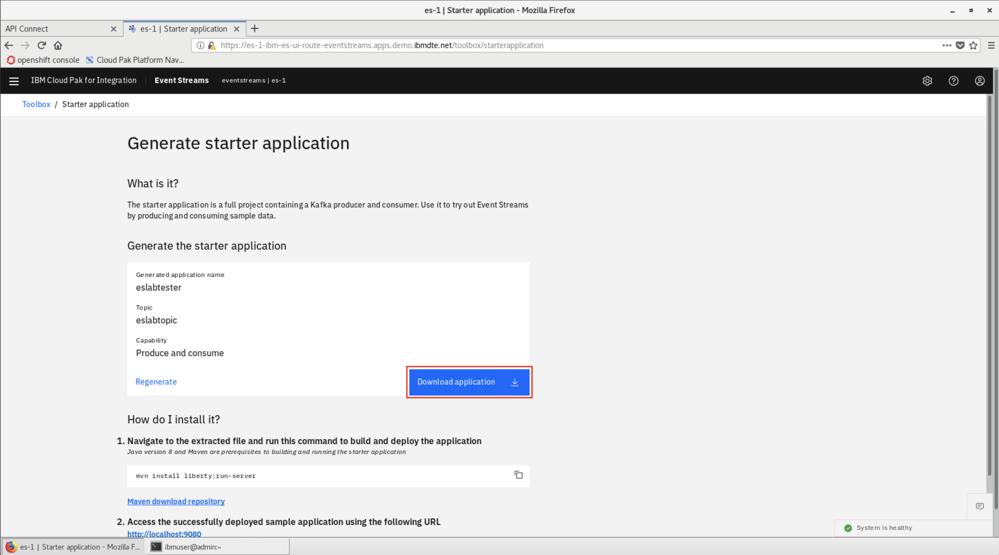
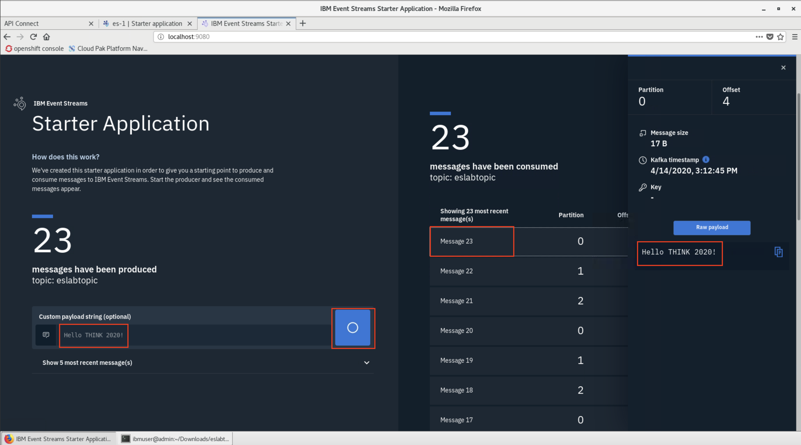
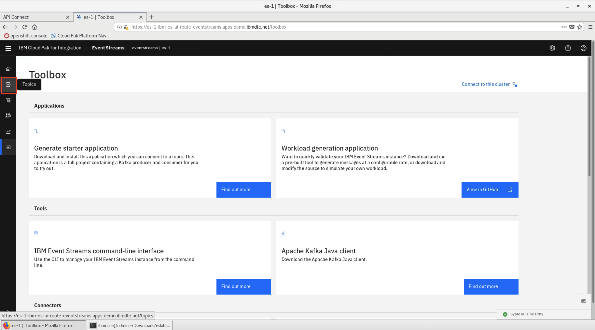
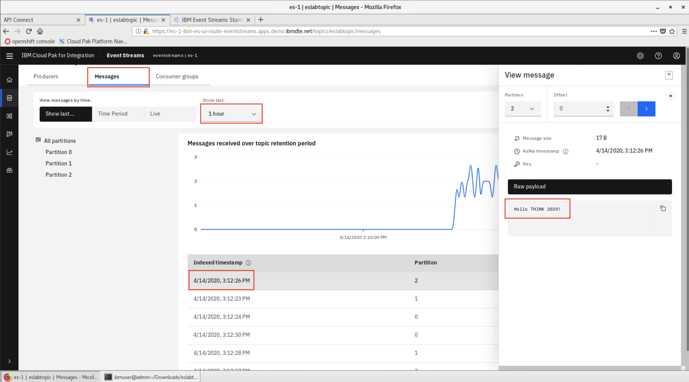
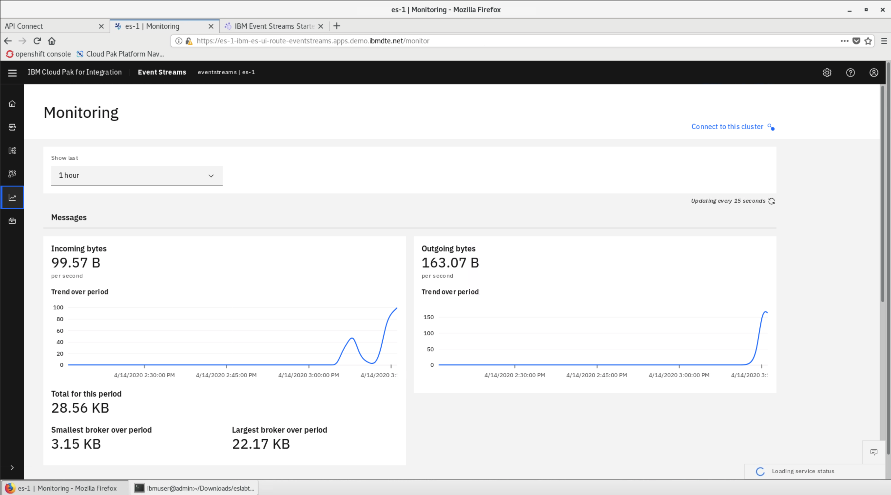

# Exercise: Using IBM Event Streams for near real-time data replication

In this lab you will use IBM Event Streams to replicate data from a transactional database to a reporting database. The pattern used allows for seamless horizontal scaling to minimize the latency between the time the transaction is committed to the transactional database and when it is available to be queried in the reporting database. Applications connect to Event Streams topics and write to and read from them. Topics are known groupings of related data. Topics are created and configured by the Event Streams administrator.

* The **event-producer** microservice consumes the transaction data from an application and sends it to a topic in Event Streams. By scaling this service horizontally you can decrease the latency between the time the transaction is committed to the transactional database and when it is available to be queried in the reporting database.

* The **event-consumer** microservice receives the transaction data from Event Streams and reads it. By scaling this service horizontally you can decrease the latency between the time the transaction is committed to the transactional database and when it is available to be queried in the reporting database.

## Steps

1. [Create a topic in Event Streams](#1-create-a-topic-in-event-streams)
1. [Generate a starter application to send and receive data](#2-generate-a-starter-application-to-send-and-receive-data)
1. [Run the starter application](#3-run-the-starter-application)
1. [Use the Event Streams Toolbox to view messages](#4-use-the-event-streams-toolbox-to-view-messages)
1. [Summary](#summary)

### 1. Create a topic in the Event Streams Management Console

In a new browser tab open the **Cloud Pak for Integration** tab and under **View Instances** click on the link for **Event Streams**.



In the Event Streams interface, click **Create topic**.


Enter `eslabtopic` as the topic name and click **Next**.


> **NOTE**: This lab is preconfigured to connect to that specific topic. You can view the full range of configuration options by setting the Show all available options to on. However, this tutorial only focuses on the core set.

Set the number of partitions to **three** and click **Next**.


Define the message retention time. Set it to **10 minutes** for this lab. Click **Next**.



Define the number of replicas for your topic. Select the default setting of **Replication factor: 3** and **Minimum in-sync replicas: 2**. Click **Create topic**.



The Topics page is displayed. Your new topic is displayed along with a completion notification. You can now connect the starter application to Event Streams.


### 2. Generate a starter application to send and receive data

We'll now learn how to generate and run a starter application. Using the starter application, you can see how producing and consuming applications connect to a topic and send messages. Data sent by the producer can be viewed in the topic in Event Streams. You can then view the same data in the consuming application.

Event Streams includes several tools that can be used to test Event Streams and help with the development of Event Steams-based applications. To start we'll click on the **Toolbox** icon in the primary navigation on the left.


Go to the **Generate starter application** section and click **Find out more**. The Generate starter application page is displayed where you can configure and generate an application, run a liberty profile server, and send and receive messages.



Click **Configure and generate application** to open the configuration panel for the starter application and configure the application as follows:

* Application name: `eslabtester`.
* Ensure both **Produce messages** and **Consume messages** are selected.
* Select Existing topic, choose `eslabtopic`.
* Click **Generate starter application**.



Event Streams will begin to generate the starter application. When it has been generated, click **Download application** to begin downloading the starter application.



> **NOTE**: Remember to choose to **Save the file** instead of opening the file.

### 3. Run the starter application

Before we launch the application we have to update the Maven version that is pre-installed.

Open a terminal and run the following commands to upgrade Maven to 3.6.3.

```bash
cd ~
wget https://httpd-mirror.sergal.org/apache/maven/maven-3/3.6.3/binaries/apache-maven-3.6.3-bin.zip
unzip apache-maven-3.6.3-bin.zip
export PATH=~/apache-maven-3.6.3/bin:$PATH
```

Ensure Maven is at the right version (>3.6.0) by running

```bash
mvn --version
```

From the terminal run the following commands to move and unzip the start application:

```bash
cd ~/Downloads
mkdir eslabtester
mv IBMEventStreams_eslabtester.zip eslabtester
cd eslabtester
unzip IBMEventStreams_eslabtester.zip
```

Run the following command to disable URL checking in Java:

```bash
export JAVA_OPTIONS=Djdk.net.URLClassPath.disableClassPathURLCheck=true
```

Now run this command to start the application:

```bash
mvn install liberty:run-server
```

When the message `The server defaultServer is ready to run a smarter planet` is displayed, the application is ready and running.

```bash
$ mvn install liberty:run-server
...
[INFO] [AUDIT   ] CWWKT0016I: Web application available (default_host): http://admin.ibm.demo:9080/health/
[INFO] [AUDIT   ] CWWKT0016I: Web application available (default_host): http://admin.ibm.demo:9080/metrics/
[INFO] [AUDIT   ] CWWKT0016I: Web application available (default_host): http://admin.ibm.demo:9080/ibm/api/
[INFO] [AUDIT   ] CWWKT0016I: Web application available (default_host): http://admin.ibm.demo:9080/jwt/
[INFO] [WARNING ] SRVE9967W: The manifest class path jaxb-api.jar can not be found in jar file file:/home/ibmuser/Downloads/eslabtester/target/liberty/wlp/usr/servers/defaultServer/apps/expanded/eslabtester.war/WEB-INF/lib/jaxb-core-2.2.11.jar or its parent.
[INFO] [WARNING ] SRVE9967W: The manifest class path jaxb-core.jar can not be found in jar file file:/home/ibmuser/Downloads/eslabtester/target/liberty/wlp/usr/servers/defaultServer/apps/expanded/eslabtester.war/WEB-INF/lib/jaxb-impl-2.2.11.jar or its parent.
[INFO] [AUDIT   ] CWWKT0016I: Web application available (default_host): http://admin.ibm.demo:9080/
[INFO] [AUDIT   ] CWWKZ0001I: Application eslabtester started in 4.785 seconds.
[INFO] [AUDIT   ] CWWKF0012I: The server installed the following features: [appSecurity-2.0, cdi-1.2, concurrent-1.0, distributedMap-1.0, jaxrs-2.0, jaxrsClient-2.0, jndi-1.0, json-1.0, jsonp-1.0, jwt-1.0, microProfile-1.2, mpConfig-1.1, mpFaultTolerance-1.0, mpHealth-1.0, mpJwt-1.0, mpMetrics-1.0, servlet-3.1, ssl-1.0, websocket-1.1].
[INFO] [AUDIT   ] CWWKF0011I: The defaultServer server is ready to run a smarter planet. The defaultServer server started in 12.770 seconds.
```

Open the starter application by going to <http://localhost:9080> in a browser. This page represents the producing application on the left of the screen and the consuming application on the right.

In the application perform the following:

* Type a message in the **Custom payload string** field.
* Click **play** on the producer
* See messages appearing in the consuming application as they are consumed from the Event Streams topic.
* Look at the **Offset**.
* Stop the Producer by clicking the **Pause** button.



### 4. Use the Event Streams Toolbox to view messages

Return to the **Generate starter application** page and click **Toolbox**.


Click **Topics** in the primary navigation on the left and select your `eslabtopic` topic.



Use the Event Streams dashboard to evaluate the messages produced, for example, information such as the **Average message size produced per second** and the **Average number of messages produced per second**.


Click on the **Messages** tab at the top to inspect individual messages.



Click **Monitoring** in the primary navigation on the left to view the rate of incoming and outgoing data.



## Summary

**Congratulations**! You successfully completed the following key steps in this lab:

* Created an Event Streams topic.
* Generated a starter application.
* Examined messages sent to your topic in the Event Streams Management console.
